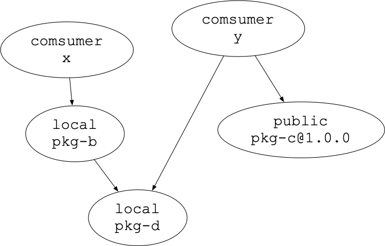
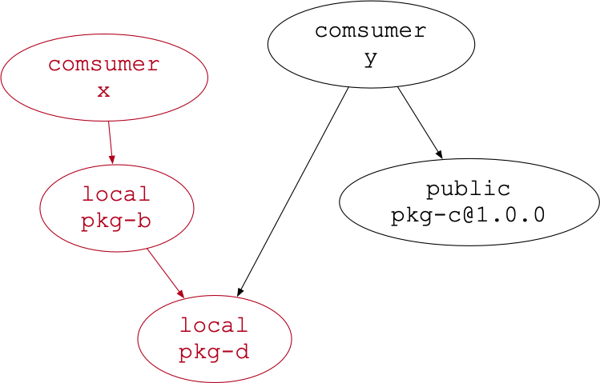
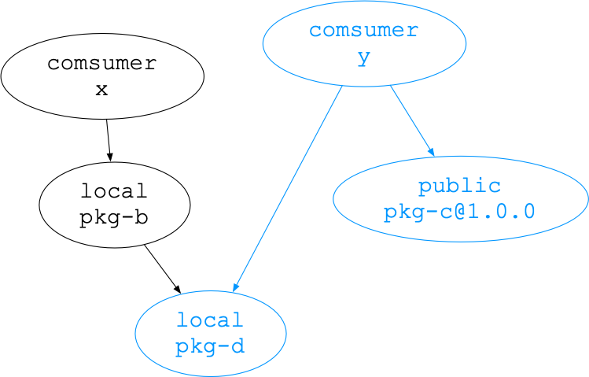

# Command Aliases: 
```
  "scripts": {
    "install:all": "pnpm i -r",
    "install:x": "pnpm i --filter \"@apollotang/consumer-x...\"",
    "install:y": "pnpm i --filter \"@apollotang/consumer-y...\"",
    "clean": "./scripts/clean.sh",
    "start:x": "pnpm start --filter \"@apollotang/consumer-x\"",
    "start:y": "pnpm start --filter \"@apollotang/consumer-y\""
  }
```

# Instruction: 

Start local registry:

```
$ verdaccio
```

Go to directory:

```
$ cd pnpm-filter-studies/workspace
```

---


### No Filter

```
$ pnpm clean
$ pnpm install:all
```


```
$ tree -Fa --dirsfirst  (only show relevent output)
.
├── node_modules/
│   └── .pnpm/
│       │ 
│       ├── @apollotang/
│       │   └── public-pkg-c@1.0.0/
│       │       └── node_modules/
│       │           └── @apollotang/
│       │               └── public-pkg-c/
│       │                   └── package.json
│       └── node_modules/
│           └── @apollotang/
│               └── public-pkg-c -> ../../@apollotang/public-pkg-c@1.0.0/node_modules/@apollotang/public-pkg-c/
│
├── pkgs-consumer/
│   │
│   ├── consumer-pkg-x/
│   │   ├── node_modules/
│   │   │   └── @apollotang/
│   │   │       └── local-pkg-b -> ../../../../pkgs-local/local-pkg-b/
│   │   └── package.json
│   │
│   └── consumer-pkg-y/
│       ├── node_modules/
│       │   └── @apollotang/
│       │       ├── local-pkg-d -> ../../../../pkgs-local/local-pkg-d/
│       │       └── public-pkg-c -> ../../../../node_modules/.pnpm/@apollotang/public-pkg-c@1.0.0/node_modules/@apollotang/public-pkg-c/
│       └── package.json
│
├── pkgs-local/
│   │
│   ├── local-pkg-b/
│   │   ├── node_modules/
│   │   │   └── @apollotang/
│   │   │       └── local-pkg-d -> ../../../local-pkg-d/
│   │   └── package.json
│   │
│   └── local-pkg-d/
│       ├── src/
│       │   └── index.js
│       └── package.json
│
├── pkgs-public/
│   └── public-pkg-c/
│       ├── .npmrc
│       └── package.json
│
├── .npmrc
├── package.json
├── pnpm-lock.yaml
└── pnpm-workspace.yaml


```

---

### Filter by consumer-x
```
$ pnpm clean
$ pnpm install:x

```



```
$ tree -Fa --dirsfirst   (only show relevent output)
.
│
├── node_modules/
│   └── .pnpm/
│       └── lock.yaml
│
├── pkgs-consumer/
│   │
│   ├── consumer-pkg-x/
│   │   ├── node_modules/
│   │   │   └── @apollotang/
│   │   │       └── local-pkg-b -> ../../../../pkgs-local/local-pkg-b/
│   │   └── package.json
│   │
│   └── consumer-pkg-y/
│       └── package.json
│
├── pkgs-local/
│   │
│   ├── local-pkg-b/
│   │   ├── node_modules/
│   │   │   └── @apollotang/
│   │   │       └── local-pkg-d -> ../../../local-pkg-d/
│   │   └── package.json
│   │
│   └── local-pkg-d/
│       └── package.json
│
├── pkgs-public/
│   │
│   └── public-pkg-c/
│       ├── .npmrc
│       └── package.json
│
├── .npmrc
├── package.json
├── pnpm-lock.yaml
└── pnpm-workspace.yaml
```
---

### Filter by consumer-y
```
$ pnpm clean
$ pnpm install:y

```


```
$ tree -Fa --dirsfirst    (only show relevent output)
.
├── node_modules/
│   │
│   └── .pnpm/
│       ├── @apollotang/
│       │   └── public-pkg-c@1.0.0/
│       │       └── node_modules/
│       │           └── @apollotang/
│       │               └── public-pkg-c/
│       │                   └── package.json
│       └── node_modules/
│           └── @apollotang/
│               └── public-pkg-c -> ../../@apollotang/public-pkg-c@1.0.0/node_modules/@apollotang/public-pkg-c/
│
├── pkgs-consumer/
│   │
│   ├── consumer-pkg-x/
│   │   └── package.json
│   │
│   └── consumer-pkg-y/
│       ├── node_modules/
│       │   └── @apollotang/
│       │       ├── local-pkg-d -> ../../../../pkgs-local/local-pkg-d/
│       │       └── public-pkg-c -> ../../../../node_modules/.pnpm/@apollotang/public-pkg-c@1.0.0/node_modules/@apollotang/public-pkg-c/
│       └── package.json
│
├── pkgs-local/
│   │
│   ├── local-pkg-b/
│   │   └── package.json
│   │
│   └── local-pkg-d/
│       └── package.json
│
├── pkgs-public/
│   │
│   └── public-pkg-c/
│       ├── .npmrc
│       └── package.json
│
├── .npmrc
├── package.json
├── pnpm-lock.yaml
└── pnpm-workspace.yaml
```
